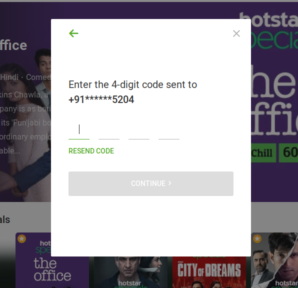
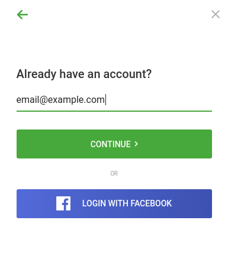
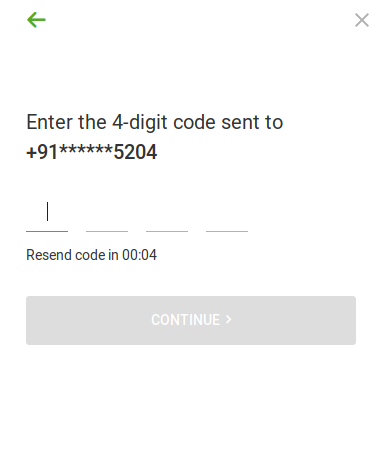

Hotstar is an Indian streaming service owned by Star India, which itself is a wholly owned subsidiary of The Walt Disney Company. Over the past few years, it gained a lot of eyeballs due to recent internet revolution in India, which made the internet easily accessible and affordable.

This year Hotstar became one and only online streaming service for IPL (Indian Premier League) and GOT (Game of Thrones S8), which are accessible online via the subscriptions pack on Hotstar only. On the contrary, it's a little bit early in India to adopt subscription-based services.

It was March of 2019, one of the crucial time for Hotstar as IPL was about to start and GOT too. Unfortunately, somehow user credentials got leaked on a wide basis. Which includes user's email and password in plain text along with the details of their subscription plan and expiration date.

This security breach made accessing premium content for free. As soon as they(Hotstar) came to know about this situation they reacted back by adding one more step to their authentication process in order to prevent alien access by enabling 2FA (OPT). This took them about a month to get this feature into production.

#### Is it a marketing strategy

In early 90s Microsoft knowingly allowed piracy of Microsoft Windows in developing countries like China, and this emerged as one of the successful strategy ever adopted by Microsoft.

<iframe width="400" height="225" src="https://www.youtube.com/embed/fGIrnT5yPWo" frameborder="0" allow="accelerometer; autoplay; encrypted-media; gyroscope; picture-in-picture" allowfullscreen></iframe>

Similarly, Hotstar is letting other people use their service in an odd way to convert users. This is just my speculation.

Let's get back to the Login system of Hotstar



Unfortunately, I found a way to bypass this 2FA and login to an account by just using `email` and `password`.

> **Disclaimer** =>
> I am not encouraging anyone to login to others account. This is just for demonstration and learning purposes.

#### Understanding the user types

Hotstar has two types of registered users, i.e. `phone` and `merged`. In simple terms, a user of type `phone` is one who has linked his account to his mobile number and `merged` is one who has only email linked.

```json
{
  "description": { "exists": true, "usertype": "phone" },
  "message": "Success",
  "appCode": "UMSP_701"
}
```

```json
{
  "description": { "exists": true, "usertype": "merged" },
  "message": "Success",
  "appCode": "UMSP_701"
}
```

#### The Login Flow

A user can log in via various methods, but today we will focus on logging in with email.


Both the type of users i.e. `phone` and `merged` can log in to their account by using the linked `email`.



If the email entered belongs to a userType `phone`, then that user is asked to enter the OTP (as shown below). Followed by a password prompt.



If a userType of `merged` who can login to his account, by using the password only. If that email is filled in the login form. Then you are asked to type the password (as shown below).


Now here comes the interesting part. If you erase the email field and enter an email which is linked to an account of type `phone`, and enter the correct password and hit continue.
**Voila you are now successfully logged in and bypassed the OTP verification🎉**

Heres the response from the server.

> userType = `merged`

```json
{
  "description": {
    "userIdentity": "eyJhbGciOiJIUzI1NiJ9.eyJzdWIiOiJ7XCJoSWRcIjpcImFjbnxyYW1lc2hhZGRzQGdtYWlsLmNvbVwiLFwicElkXCI6XCJyYW1lc2hhZGRzQGdtYWlsLmNvbVwiLFwibmFtZVwiOlwiUmFtZXNoIEFkZHUgQWRkdSBBZGR1XCIsXCJlbWFpbFwiOlwicmFtZXNoYWRkc0BnbWFpbC5jb21cIixcImV4dEF1dGhJZFwiOlwiMTAxNTcyMTYyNDg1ODI1NzVcIixcImlwXCI6XCIxMDYuMjA4LjEzMi41XCIsXCJjb3VudHJ5Q29kZVwiOlwiaW5cIixcImN1c3RvbWVyVHlwZVwiOlwibnVcIixcInR5cGVcIjpcIm1lcmdlZFwiLFwiaXNFbWFpbFZlcmlmaWVkXCI6ZmFsc2UsXCJpc1Bob25lVmVyaWZpZWRcIjpmYWxzZSxcImRldmljZUlkXCI6XCIwOWMxZmU1NS05ZDNmLTRlNTQtOGQ1OS02NTBlZGNlMjMzZTlcIixcInZlcnNpb25cIjpcInYyXCIsXCJzdWJzY3JpcHRpb25zXCI6e1wiaW5cIjp7XCJTcG9ydHNQYWNrXCI6e1wic2hvd0Fkc1wiOlwiMVwiLFwiZXhwaXJ5XCI6XCIyMDE5LTExLTAzVDE0OjQ5OjQzLjAwMFpcIixcInN0YXR1c1wiOlwiQ1wifX19LFwiaXNzdWVkQXRcIjoxNTYyNDkxMjgyNTQ4fSIsImlzcyI6IlVNIiwiZXhwIjoxNTYyNTc3NjgyfQ.Qh3bxDH5mAlAGTQMnm0wbTdxUhUmEV_e3zMZwu0YSL8"
  },
  "message": "Login Success",
  "appCode": "UMSP_700"
}
```

> userType = `phone`

```json
{
  "description": {
    "userIdentity": "eyJhbGciOiJIUzI1NiJ9.eyJzdWIiOiJ7XCJoSWRcIjpcImFjbnxwcml5YWhvdHN0dWZmQGdtYWlsLmNvbVwiLFwicElkXCI6XCJwcml5YWhvdHN0dWZmQGdtYWlsLmNvbVwiLFwibmFtZVwiOlwiUHJpeWFua2EgU29uaSBTb25pXCIsXCJlbWFpbFwiOlwicHJpeWFob3RzdHVmZkBnbWFpbC5jb21cIixcInBob25lXCI6XCI3Mjg0OTIyODgzXCIsXCJleHRBdXRoSWRcIjpcIjEwMTU0OTc5ODI1MTI0MzY5XCIsXCJpcFwiOlwiMTA2LjIwOC4xMzIuNVwiLFwiY291bnRyeUNvZGVcIjpcImluXCIsXCJjdXN0b21lclR5cGVcIjpcIm51XCIsXCJ0eXBlXCI6XCJtZXJnZWRcIixcImlzRW1haWxWZXJpZmllZFwiOmZhbHNlLFwiaXNQaG9uZVZlcmlmaWVkXCI6dHJ1ZSxcImRldmljZUlkXCI6XCIwOWMxZmU1NS05ZDNmLTRlNTQtOGQ1OS02NTBlZGNlMjMzZTlcIixcInZlcnNpb25cIjpcInYyXCIsXCJzdWJzY3JpcHRpb25zXCI6e1wiaW5cIjp7XCJIb3RzdGFyUHJlbWl1bVwiOntcInNob3dBZHNcIjpcIjBcIixcImV4cGlyeVwiOlwiMjAxOS0xMC0wMVQxNDozNzo0OS4wMDBaXCIsXCJzdGF0dXNcIjpcIkNcIn19fSxcImlzc3VlZEF0XCI6MTU2MjQ5MTQxMDA2NX0iLCJpc3MiOiJVTSIsImV4cCI6MTU2MjU3NzgxMH0.qxnOPa8OI6LvivBI4inLcoA-Aq7SUX0uccuNCPuI6HM"
  },
  "message": "Login Success",
  "appCode": "UMSP_700"
}
```

### How its happening

IMO, when the login form is submitted, the server is not checking the `userType`. It only matches password and email irrespective of the user type.

### Conclusion

Never trust frontend, always perform validations at the backend.
